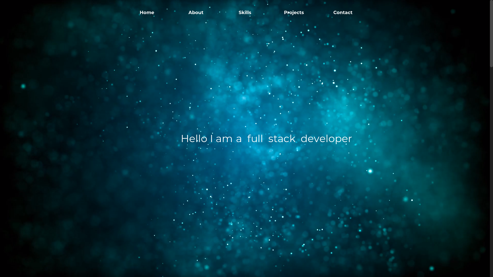

Welcome to the source code of my personal portfolio, while your still on Github have a look at my other repositories. This site is a copy of the original one built on Ruby on rails which you can visit: https://github.com/jmart6784/portfolio I decided to discontiue updating that one because of heroku's free tier "sleeping" dynos. Which basically means that the site sleeps and takes around 15 seconds to load. So I made this copy (made with React.js) that is hosted on Github pages.

Visit this project live at: https://juan-martinez.work
